# PWChrono HRMS - Business Process Flow & Data Model

**Generated:** 2026-05-26  
**Purpose:** Complete data model documentation highlighting parent objects and their key fields

---

## Executive Summary

The PWChrono HRMS portal is a comprehensive HR management system built on Salesforce, consisting of:

- **15 Parent/Master Objects** (configuration and master data)
- **15+ Child/Transaction Objects** (operational transactions)
- **Core Entity:** `Portal_Users__c` (Employee)

---

## 1. ORGANIZATIONAL SETUP (Master Data)

### 1.1 PWChrono_Department\_\_c ⭐ PARENT

**Purpose:** Organizational department structure with hierarchy support

**Key Fields:**

- `Name` (Text) - Department Name
- `Department_Code__c` (Text, Unique) - Department identifier
- `Department_Head__c` (Lookup → Portal_Users\_\_c) - Department manager
- `Parent_Department__c` (Lookup → Self) - Hierarchical parent
- `Description__c` (Long Text) - Department details
- `Is_Active__c` (Checkbox, default=true) - Active status

**Business Rules:**

- Supports nested department hierarchy
- Each department can have one department head

---

### 1.2 PWChrono_Designation\_\_c ⭐ PARENT

**Purpose:** Job roles and positions with grade levels

**Key Fields:**

- `Name` (Text) - Designation title
- `Designation_Code__c` (Text, Unique) - Role identifier
- `Grade__c` (Picklist) - L1, L2, L3, L4, Manager, Senior Manager, Director, VP
- `Job_Description__c` (Long Text) - Role responsibilities
- `Required_Skills__c` (Long Text) - Required competencies
- `Is_Active__c` (Checkbox, default=true) - Active status

**Business Rules:**

- Grade-based hierarchy (L1 to VP)
- Used in salary structures and job openings

---

## 2. EMPLOYEE MANAGEMENT

### 2.1 Portal_Users\_\_c ⭐ PARENT (Core Entity)

**Purpose:** Central employee/user repository - the heart of HRMS

**Key Fields:**

**Identity & Contact:**

- `Name` (Text) - Employee name
- `Email__c` (Email) - Email address
- `Phone__c` (Phone) - Contact number
- `Photo_Url__c` (URL) - Employee photo

**Organizational:**

- `Department__c` (Text) - Department assignment
- `Designation__c` (Text) - Job title
- `Reports_To__c` (Lookup → Self) - Manager hierarchy
- `Date_of_Joining__c` (Date) - Joining date
- `Address__c` (Text) - Address

**System & Access:**

- `Role__c` (Picklist) - Employee, Manager, HR Admin, Project Manager, Payroll Admin
- `Is_Active__c` (Checkbox) - Active status
- `User__c` (Lookup → User) - Salesforce user linkage
- `Session_Token__c` (Text) - Authentication token
- `EncryptedPassword__c` (Text) - Password field
- `Last_Login_Date__c` (DateTime) - Last access

**Relationships:**

- `Contact__c` (Lookup → Contact)
- `Account__c` (Lookup → Account)
- `Portal_User_Profile__c` (Lookup → Portal_User_Profile\_\_c)

**Emergency:**

- `Emergency_Contact_Name__c`, `Emergency_Contact_Phone__c`

**Referenced By:** All transaction objects (Leave, Appraisal, Salary Slip, Attendance, etc.)

---

### 2.2 Portal_User_Profile\_\_c ⭐ PARENT

**Purpose:** User profile configuration and permissions

**Referenced By:** Portal_Users\_\_c

---

## 3. LEAVE MANAGEMENT

### 3.1 PWChrono_Leave_Type\_\_c ⭐ PARENT

**Purpose:** Leave type master configuration (Casual, Sick, Privilege, etc.)

**Key Fields:**

**Identity:**

- `Name` (Text) - Leave type name (e.g., "Casual Leave")
- `Description__c` (Long Text) - Leave type details
- `Color_Code__c` (Text) - UI color coding

**Policy Configuration:**

- `Allow_Half_Day__c` (Checkbox, default=true)
- `Allow_Negative_Balance__c` (Checkbox)
- `Is_Unpaid__c` (Checkbox)
- `Is_Carry_Forward__c` (Checkbox)
- `Is_Encashable__c` (Checkbox)
- `Requires_Approval__c` (Checkbox)
- `Requires_Certificate__c` (Checkbox)

**Calculation Rules:**

- `Include_Weekends__c` (Checkbox)
- `Include_Holidays__c` (Checkbox)
- `Max_Days_Allowed__c` (Number)
- `Max_Consecutive_Days__c` (Number)
- `Min_Days_Per_Request__c` (Number)
- `Max_Carry_Forward_Days__c` (Number)
- `Applicable_After_Days__c` (Number) - Eligibility period

**Other:**

- `Is_Active__c` (Checkbox, default=true)
- `Sort_Order__c` (Number) - Display order

**Referenced By:**

- PWChrono_Leave_Allocation\_\_c
- PWChrono_Leave\_\_c
- PWChrono_Leave_Policy\_\_c

---

### 3.2 PWChrono_Leave_Period\_\_c ⭐ PARENT

**Purpose:** Fiscal/calendar leave period definition

**Key Fields:**

- `Name` (Text) - Period name (e.g., "FY 2025-26")
- `From_Date__c` (Date) - Period start
- `To_Date__c` (Date) - Period end
- `Is_Active__c` (Checkbox) - Active period

---

### 3.3 PWChrono_Leave_Policy\_\_c ⭐ PARENT

**Purpose:** Leave allocation policies by department/designation

**Key Fields:**

- `Policy_Name__c` (Text)
- `Leave_Type__c` (Lookup → PWChrono_Leave_Type\_\_c)
- `Department__c` (Lookup → PWChrono_Department\_\_c)
- `Designation__c` (Lookup → PWChrono_Designation\_\_c)
- `Annual_Allocation__c` (Number) - Yearly leave quota
- `Prorate_on_Joining__c` (Checkbox)
- `Effective_From__c`, `Effective_To__c` (Date)
- `Is_Active__c` (Checkbox)

---

### 3.4 PWChrono_Holiday_List\_\_c ⭐ PARENT

**Purpose:** Holiday calendar master

**Referenced By:** PWChrono_Holiday\_\_c (holiday dates)

---

### 3.5 PWChrono_Holiday\_\_c ⭐ PARENT

**Purpose:** Individual holiday definitions

**Key Fields:**

- Holiday dates and descriptions
- Holiday_List**c (Lookup → PWChrono_Holiday_List**c)

---

### 3.6 PWChrono_Leave_Allocation\_\_c (Transaction)

**Purpose:** Employee's leave balance per leave type

**Key Relationships:**

- `Employee__c` → Portal_Users\_\_c
- `Leave_Type__c` → PWChrono_Leave_Type\_\_c

**Key Fields:**

- `Total_Leaves_Allocated__c` (Number)
- `Carry_Forwarded_Leaves__c` (Number)
- `Total_Leaves_Used__c` (Number)
- `Total_Leaves_Encashed__c` (Number)
- `From_Date__c`, `To_Date__c` (Date)

---

### 3.7 PWChrono_Leave\_\_c (Transaction)

**Purpose:** Employee leave applications

**Key Relationships:**

- `Employee__c` → Portal_Users\_\_c
- `Leave_Type__c` → PWChrono_Leave_Type\_\_c
- `Leave_Allocation__c` → PWChrono_Leave_Allocation\_\_c
- `Approver__c` → Portal_Users\_\_c

**Key Fields:**

- `Status__c` (Picklist) - Draft, Submitted, Approved, Rejected, Cancelled
- `From_Date__c`, `To_Date__c` (Date)
- `Total_Days__c` (Number)
- `Half_Day__c` (Checkbox)
- `Reason__c` (Text)
- `Rejected_Reason__c` (Text)

---

### 3.8 PWChrono_Leave_Ledger\_\_c (Transaction)

**Purpose:** Leave transaction history/audit trail

**Key Relationships:**

- `Employee__c` → Portal_Users\_\_c
- `Leave_Type__c` → PWChrono_Leave_Type\_\_c
- `Leave__c` → PWChrono_Leave\_\_c

**Key Fields:**

- `Transaction_Type__c` - Credit/Debit
- `Days__c` (Number)
- `Balance_After__c` (Number)
- `Transaction_Date__c` (Date)

---

### 3.9 PWChrono_Leave_Encashment\_\_c (Transaction)

**Purpose:** Leave encashment requests

**Key Relationships:**

- `Employee__c` → Portal_Users\_\_c
- `Leave_Type__c` → PWChrono_Leave_Type\_\_c

**Key Fields:**

- `Status__c` - Approval status
- `Leave_Days__c` (Number)
- `Encashment_Amount__c` (Currency)
- `Encashment_Date__c` (Date)

---

### 3.10 PWChrono_Leave_Block_Date\_\_c (Configuration)

**Purpose:** Dates when leaves are restricted

**Key Fields:**

- `Block_Date__c` (Date)
- `Department__c` (Lookup)
- `Allow_Exceptions__c` (Checkbox)
- `Reason__c` (Text)

---

## 4. RECRUITMENT MANAGEMENT

### 4.1 PWChrono_Job_Opening\_\_c ⭐ PARENT

**Purpose:** Job position requisitions

**Key Fields:**

- `Name` (Text) - Job title
- `Job_Description__c` (Long Text)
- `Department__c` (Lookup → PWChrono_Department\_\_c)
- `Designation__c` (Lookup → PWChrono_Designation\_\_c)
- `No_of_Positions__c` (Number, default=1)
- `Status__c` (Picklist) - Open, In Progress, On Hold, Closed
- `Closing_Date__c` (Date)

**Referenced By:** PWChrono_Job_Applicant\_\_c

---

### 4.2 PWChrono_Job_Applicant\_\_c (Transaction)

**Purpose:** Candidate applications

**Key Relationships:**

- `Job_Opening__c` → PWChrono_Job_Opening\_\_c
- `Referrer__c` → Portal_Users\_\_c

**Key Fields:**

- `Status__c` - Applied, Screening, Interview Scheduled, Selected, Rejected, Offer Extended, Accepted
- `Email__c`, `Phone__c`
- `Experience_Years__c` (Number)
- `Resume__c` (Attachment)

**Referenced By:** PWChrono_Interview\_\_c

---

### 4.3 PWChrono_Interview\_\_c (Transaction)

**Purpose:** Interview scheduling and feedback

**Key Relationships:**

- `Job_Applicant__c` → PWChrono_Job_Applicant\_\_c
- `Interviewer__c` → Portal_Users\_\_c

**Key Fields:**

- `Interview_Date__c` (DateTime)
- `Round__c` (Number)
- `Result__c` (Picklist)
- `Feedback__c` (Text)

---

### 4.4 PWChrono_Offer_Letter\_\_c (Transaction)

**Purpose:** Job offer generation

**Key Relationships:**

- Job_Applicant**c → PWChrono_Job_Applicant**c

---

### 4.5 PWChrono_Onboarding_Task\_\_c (Transaction)

**Purpose:** New hire onboarding checklist

---

## 5. PERFORMANCE MANAGEMENT

### 5.1 PWChrono_Performance_Cycle\_\_c ⭐ PARENT

**Purpose:** Performance review cycle configuration

**Key Fields:**

- `Name` (Text) - Cycle name
- `Type__c` (Picklist, required) - Quarterly Review, Annual Appraisal
- `Start_Month__c`, `Start_Day__c`
- `End_Month__c`, `End_Day__c`
- `Is_Active__c` (Checkbox)
- `Minimum_Tenure_Months__c` (Number)

**Referenced By:** PWChrono_Appraisal\_\_c

---

### 5.2 PWChrono_Appraisal\_\_c (Transaction)

**Purpose:** Employee performance appraisals

**Key Relationships:**

- `Employee__c` → Portal_Users\_\_c
- `Reviewer__c` → Portal_Users\_\_c
- `Performance_Cycle__c` → PWChrono_Performance_Cycle\_\_c

**Key Fields:**

- `Status__c` - Draft, In Progress, Completed, Approved
- `Overall_Rating__c` (Number, 3,1)
- `Self_Rating__c` (Number)
- `Achievements__c`, `Feedback__c` (Text)
- `Proposed_Amount__c` (Currency) - Salary increase
- `Start_Date__c`, `End_Date__c`, `Effective_Date__c`

---

### 5.3 PWChrono_Goal\_\_c (Transaction)

**Purpose:** Employee goal setting and tracking

**Key Relationships:**

- Employee**c → Portal_Users**c
- Appraisal**c → PWChrono_Appraisal**c

---

### 5.4 Performance_Review\_\_c (Transaction)

**Purpose:** Performance review records

---

## 6. PAYROLL MANAGEMENT

### 6.1 PWChrono_Salary_Component\_\_c ⭐ PARENT

**Purpose:** Salary component definitions (Basic, HRA, DA, etc.)

**Key Fields:**

- Component name and type (Earning/Deduction)
- Calculation formula
- Is_Active\_\_c

**Referenced By:** PWChrono_Structure_Component\_\_c

---

### 6.2 PWChrono_Salary_Structure\_\_c ⭐ PARENT

**Purpose:** Salary structure templates

**Key Fields:**

- `Name` (Text) - Structure name
- `Department__c` (Lookup → PWChrono_Department\_\_c)
- `Designation__c` (Lookup → PWChrono_Designation\_\_c)
- `Is_Active__c` (Checkbox)

**Referenced By:** PWChrono_Structure_Component\_\_c

---

### 6.3 PWChrono_Structure_Component\_\_c (Configuration)

**Purpose:** Junction object linking salary structures with components

**Key Relationships:**

- Salary_Structure**c → PWChrono_Salary_Structure**c
- Salary_Component**c → PWChrono_Salary_Component**c

**Key Fields:**

- Amount or percentage for each component

---

### 6.4 PWChrono_Salary_Assignment\_\_c (Transaction)

**Purpose:** Employee salary structure assignment

**Key Relationships:**

- Employee**c → Portal_Users**c
- Salary_Structure**c → PWChrono_Salary_Structure**c

**Key Fields:**

- Effective_From**c, Effective_To**c
- Base_Salary\_\_c (Currency)

---

### 6.5 PWChrono_Salary_Slip\_\_c (Transaction)

**Purpose:** Monthly salary slip generation

**Key Relationships:**

- `Employee__c` → Portal_Users\_\_c

**Key Fields:**

- `Status__c` - Draft, Submitted, Approved, Rejected, Cancelled
- `Payroll_Period__c` (Date)
- `Gross_Pay__c` (Currency, 18,2)
- `Net_Pay__c` (Currency, 18,2)
- `Total_Deductions__c` (Currency)
- `Earning_Details__c`, `Deduction_Details__c` (Text)

---

### 6.6 PWChrono_Salary_History\_\_c (Transaction)

**Purpose:** Salary revision history

**Key Relationships:**

- Employee**c → Portal_Users**c

---

### 6.7 PWChrono_Bonus\_\_c (Transaction)

**Purpose:** Bonus/incentive payments

**Key Relationships:**

- Employee**c → Portal_Users**c

**Key Fields:**

- Bonus_Type**c, Amount**c, Payment_Date\_\_c

---

### 6.8 PWChrono_Tax_Declaration\_\_c (Transaction)

**Purpose:** Employee tax declaration (e.g., 80C, HRA)

**Key Relationships:**

- Employee**c → Portal_Users**c

---

## 7. ATTENDANCE MANAGEMENT

### 7.1 PWChrono_Shift_Type\_\_c ⭐ PARENT

**Purpose:** Shift master data (General, Night, Rotational)

**Key Fields:**

- Shift name, timings
- Start_Time**c, End_Time**c
- Is_Active\_\_c

**Referenced By:** PWChrono_Shift_Assignment\_\_c

---

### 7.2 PWChrono_Shift_Assignment\_\_c (Transaction)

**Purpose:** Employee shift assignments

**Key Relationships:**

- Employee**c → Portal_Users**c
- Shift_Type**c → PWChrono_Shift_Type**c

**Key Fields:**

- Effective_From**c, Effective_To**c

**Referenced By:** PWChrono_Attendance_Request\_\_c

---

### 7.3 PWChrono_Attendance_Request\_\_c (Transaction)

**Purpose:** Attendance correction/regularization requests

**Key Relationships:**

- `Employee__c` → Portal_Users\_\_c
- `Approver__c` → Portal_Users\_\_c
- `Shift_Assignment__c` → PWChrono_Shift_Assignment\_\_c

**Key Fields:**

- `Status__c` - Draft, Submitted, Approved, Rejected, Cancelled
- `Attendance_Date__c` (Date)
- `Correction_Type__c` (Picklist)
- `From_Time__c`, `To_Time__c` (Time)
- `Actual_Check_In__c`, `Actual_Check_Out__c` (DateTime)
- `Reason__c` (Text)

---

## 8. TRAINING & DEVELOPMENT

### 8.1 PWChrono_Training_Program\_\_c ⭐ PARENT

**Purpose:** Training program catalog

**Key Fields:**

- Program name and description
- Training_Type\_\_c (Technical, Soft Skills, Compliance)
- Duration**c, Is_Active**c

**Referenced By:** PWChrono_Training_Event\_\_c

---

### 8.2 PWChrono_Training_Event\_\_c (Transaction)

**Purpose:** Scheduled training sessions

**Key Relationships:**

- `Training_Program__c` → PWChrono_Training_Program\_\_c

**Key Fields:**

- `Status__c` - Scheduled, In Progress, Completed, Cancelled
- `Start_Date__c`, `End_Date__c` (Date)
- `Location__c` (Text)

**Referenced By:** PWChrono_Training_Attendance\_\_c

---

### 8.3 PWChrono_Training_Attendance\_\_c (Transaction)

**Purpose:** Employee training attendance tracking

**Key Relationships:**

- Employee**c → Portal_Users**c
- Training_Event**c → PWChrono_Training_Event**c

**Key Fields:**

- Attendance_Status**c, Completion_Status**c

---

## 9. EXPENSE MANAGEMENT

### 9.1 PWChrono_Expense_Claim\_\_c (Transaction)

**Purpose:** Employee expense reimbursement claims

**Key Relationships:**

- `Employee__c` → Portal_Users\_\_c
- `Approver__c` → Portal_Users\_\_c

**Key Fields:**

- `Status__c` - Draft, Submitted, Approved, Rejected, Cancelled
- `Total_Amount__c` (Currency, summary)
- `Claim_Date__c`, `Applied_Date__c`, `Approval_Date__c`
- `Business_Purpose__c`, `Description__c`
- `Rejection_Reason__c`

**Has Child:** PWChrono_Expense_Item\_\_c

---

### 9.2 PWChrono_Expense_Item\_\_c (Transaction Line Items)

**Purpose:** Line items for expense claims

**Key Relationships:**

- Expense_Claim**c → PWChrono_Expense_Claim**c

**Key Fields:**

- Expense_Type**c, Amount**c, Date\_\_c
- Receipt\_\_c (Attachment)

---

## 10. PROJECT MANAGEMENT

### 10.1 PWChrono_Project\_\_c ⭐ PARENT

**Purpose:** Client projects and internal initiatives

**Key Fields:**

- `Name` (Text) - Project name
- `Description__c` (Long Text)
- `Account__c` (Lookup → Account) - Client
- `Status__c` (Picklist) - Active, Completed, On Hold
- `Start_Date__c`, `End_Date__c` (Date)
- `Amount__c` (Currency) - Project value
- `Priority__c` (Picklist) - High, Medium, Low
- `Hours_Logged__c`, `Total_Hours__c` (Number)
- `Team_Size__c` (Number)
- `Project_Manager__c` (Text)
- `Team_Members__c` (Long Text)
- `Tags__c` (Long Text)

**Note:** Currently uses text fields for team assignments

---

## 11. BENEFITS MANAGEMENT

### 11.1 Benefit_Plan\_\_c ⭐ PARENT

**Purpose:** Company benefit plans (Health Insurance, PF, etc.)

**Key Fields:**

- Plan name and description
- Plan_Type**c, Coverage_Amount**c
- Is_Active\_\_c

**Referenced By:** Employee_Benefit\_\_c

---

### 11.2 Employee_Benefit\_\_c (Transaction)

**Purpose:** Employee benefit enrollments

**Key Relationships:**

- Employee**c → Portal_Users**c
- Benefit_Plan**c → Benefit_Plan**c

**Key Fields:**

- Enrollment_Date**c, Status**c

---

## 12. PORTAL MANAGEMENT

### 12.1 Portal_Object\_\_c ⭐ PARENT

**Purpose:** Portal object permission configuration

**Referenced By:** Portal_Object_Permission**c, Portal_Object_Field**c

---

### 12.2 Portal_Object_Permission\_\_c (Configuration)

**Purpose:** Role-based object access control

---

### 12.3 Portal_Field_Permission\_\_c (Configuration)

**Purpose:** Role-based field-level security

---

### 12.4 PWChrono_User_Feature_Access\_\_c (Configuration)

**Purpose:** User-specific feature access control

**Key Relationships:**

- Portal_User**c → Portal_Users**c

---

## 13. COMPANY POLICIES

### 13.1 PWChrono_Company_Policy\_\_c ⭐ PARENT

**Purpose:** Company policy documents

**Key Fields:**

- Policy name, description
- Policy_Type**c, Effective_Date**c
- Document\_\_c (Attachment)
- Is_Active\_\_c

---

## 14. NOTIFICATIONS & COMMUNICATIONS

### 14.1 PWChrono_Appraisal_Notification\_\_c (System)

**Purpose:** Appraisal-related notifications

---

### 14.2 PWChrono_Request_Comment\_\_c (Transaction)

**Purpose:** Comments on requests (Leave, Attendance, Expense)

**Key Relationships:**

- Request_Id\_\_c (polymorphic reference)

---

## 15. INVOICING (if applicable)

### 15.1 PWChrono_Invoice\_\_c (Transaction)

**Purpose:** Client invoicing

**Key Relationships:**

- Account\_\_c → Account

**Key Fields:**

- Invoice_Date**c, Amount**c, Status\_\_c

---

## 16. TASK MANAGEMENT (TLG Module)

### 16.1 TLG_Team\_\_c ⭐ PARENT

**Purpose:** Team definitions

**Referenced By:** TLG_Task**c, TLG_Team_Status**c

---

### 16.2 TLG_Task\_\_c (Transaction)

**Purpose:** Task/work item tracking

**Key Relationships:**

- Team**c → TLG_Team**c
- Assigned_To**c → Portal_Users**c

**Has Children:** TLG_Task_History**c, TLG_TaskFeed**c, TLG_Task_Notifications\_\_c

---

## 17. DOCUMENT MANAGEMENT

### 17.1 SwiftSign_File\_\_c (Document)

**Purpose:** Digital signature file management

---

---

# Business Process Flow Diagram

```mermaid
graph TB
    subgraph "MASTER DATA SETUP"
        DEPT[PWChrono_Department__c<br/>Department Code, Head, Hierarchy]
        DESIG[PWChrono_Designation__c<br/>Grade, Job Description]
        LTYPE[PWChrono_Leave_Type__c<br/>Policy Rules, Encashment]
        LPERIOD[PWChrono_Leave_Period__c<br/>From/To Dates]
        HLIST[PWChrono_Holiday_List__c<br/>Holiday Calendar]
        SHIFT[PWChrono_Shift_Type__c<br/>Shift Timings]
        SALCOMP[PWChrono_Salary_Component__c<br/>Earning/Deduction]
        SALSTRUCT[PWChrono_Salary_Structure__c<br/>Dept + Designation]
        PERFCYCLE[PWChrono_Performance_Cycle__c<br/>Quarterly/Annual]
        TRAINPROG[PWChrono_Training_Program__c<br/>Program Catalog]
        BENPLAN[Benefit_Plan__c<br/>Benefit Plans]
    end

    subgraph "EMPLOYEE CORE"
        PUSER[Portal_Users__c<br/>THE CORE ENTITY<br/>Email, Dept, Designation<br/>Reports_To, Role, Status]
        PROFILE[Portal_User_Profile__c<br/>User Profile Config]
    end

    subgraph "RECRUITMENT PROCESS"
        JOBOPEN[PWChrono_Job_Opening__c<br/>Positions, Department, Designation]
        JOBAPPL[PWChrono_Job_Applicant__c<br/>Candidate, Status]
        INTERVIEW[PWChrono_Interview__c<br/>Interview Schedule, Feedback]
        OFFER[PWChrono_Offer_Letter__c<br/>Offer Generation]
        ONBOARD[PWChrono_Onboarding_Task__c<br/>Onboarding Tasks]
    end

    subgraph "LEAVE MANAGEMENT"
        LPOLICY[PWChrono_Leave_Policy__c<br/>Annual Allocation Rules]
        LALLOC[PWChrono_Leave_Allocation__c<br/>Employee Leave Balance]
        LEAVE[PWChrono_Leave__c<br/>Leave Applications]
        LLEDGER[PWChrono_Leave_Ledger__c<br/>Transaction History]
        LENCRASH[PWChrono_Leave_Encashment__c<br/>Encashment Requests]
    end

    subgraph "PERFORMANCE MANAGEMENT"
        APPRAISAL[PWChrono_Appraisal__c<br/>Performance Review<br/>Ratings, Feedback]
        GOAL[PWChrono_Goal__c<br/>Goal Setting]
    end

    subgraph "PAYROLL MANAGEMENT"
        STRUCTCOMP[PWChrono_Structure_Component__c<br/>Structure + Components]
        SALASSIGN[PWChrono_Salary_Assignment__c<br/>Employee Salary Assignment]
        SALSLIP[PWChrono_Salary_Slip__c<br/>Monthly Salary Slip]
        SALHIST[PWChrono_Salary_History__c<br/>Salary Revisions]
        BONUS[PWChrono_Bonus__c<br/>Bonus Payments]
        TAX[PWChrono_Tax_Declaration__c<br/>Tax Declaration]
    end

    subgraph "ATTENDANCE MANAGEMENT"
        SHIFTASSIGN[PWChrono_Shift_Assignment__c<br/>Employee Shift]
        ATTREQ[PWChrono_Attendance_Request__c<br/>Attendance Correction]
    end

    subgraph "TRAINING MANAGEMENT"
        TRAINEVENT[PWChrono_Training_Event__c<br/>Scheduled Sessions]
        TRAINATT[PWChrono_Training_Attendance__c<br/>Attendance Tracking]
    end

    subgraph "EXPENSE MANAGEMENT"
        EXPCLAIM[PWChrono_Expense_Claim__c<br/>Expense Claims]
        EXPITEM[PWChrono_Expense_Item__c<br/>Claim Line Items]
    end

    subgraph "PROJECT MANAGEMENT"
        PROJECT[PWChrono_Project__c<br/>Client Projects<br/>Team, Timeline, Budget]
    end

    subgraph "BENEFITS MANAGEMENT"
        EMPBEN[Employee_Benefit__c<br/>Benefit Enrollments]
    end

    %% Master Data to Employee
    DEPT --> PUSER
    DESIG --> PUSER
    PROFILE --> PUSER

    %% Recruitment Flow
    DEPT --> JOBOPEN
    DESIG --> JOBOPEN
    JOBOPEN --> JOBAPPL
    PUSER -.Referrer.-> JOBAPPL
    JOBAPPL --> INTERVIEW
    PUSER -.Interviewer.-> INTERVIEW
    JOBAPPL --> OFFER
    OFFER --> ONBOARD

    %% Leave Management Flow
    LTYPE --> LPOLICY
    DEPT --> LPOLICY
    DESIG --> LPOLICY
    LPOLICY --> LALLOC
    PUSER --> LALLOC
    LTYPE --> LALLOC
    LALLOC --> LEAVE
    PUSER --> LEAVE
    LTYPE --> LEAVE
    LEAVE --> LLEDGER
    LALLOC --> LENCRASH
    LTYPE --> LENCRASH
    PUSER --> LENCRASH

    %% Performance Flow
    PERFCYCLE --> APPRAISAL
    PUSER --> APPRAISAL
    PUSER -.Reviewer.-> APPRAISAL
    APPRAISAL --> GOAL

    %% Payroll Flow
    SALSTRUCT --> STRUCTCOMP
    SALCOMP --> STRUCTCOMP
    DEPT --> SALSTRUCT
    DESIG --> SALSTRUCT
    SALSTRUCT --> SALASSIGN
    PUSER --> SALASSIGN
    SALASSIGN --> SALSLIP
    PUSER --> SALSLIP
    PUSER --> SALHIST
    PUSER --> BONUS
    PUSER --> TAX

    %% Attendance Flow
    SHIFT --> SHIFTASSIGN
    PUSER --> SHIFTASSIGN
    SHIFTASSIGN --> ATTREQ
    PUSER --> ATTREQ

    %% Training Flow
    TRAINPROG --> TRAINEVENT
    TRAINEVENT --> TRAINATT
    PUSER --> TRAINATT

    %% Expense Flow
    PUSER --> EXPCLAIM
    EXPCLAIM --> EXPITEM

    %% Project Flow
    PUSER -.Team Members.-> PROJECT

    %% Benefits Flow
    BENPLAN --> EMPBEN
    PUSER --> EMPBEN

    classDef parent fill:#FFD700,stroke:#FF8C00,stroke-width:3px,color:#000
    classDef core fill:#FF6B6B,stroke:#C92A2A,stroke-width:4px,color:#fff
    classDef transaction fill:#4ECDC4,stroke:#0A9488,stroke-width:2px

    class DEPT,DESIG,LTYPE,LPERIOD,HLIST,SHIFT,SALCOMP,SALSTRUCT,PERFCYCLE,TRAINPROG,BENPLAN,JOBOPEN,PROJECT parent
    class PUSER core
    class JOBAPPL,INTERVIEW,OFFER,ONBOARD,LPOLICY,LALLOC,LEAVE,LLEDGER,LENCRASH,APPRAISAL,GOAL,STRUCTCOMP,SALASSIGN,SALSLIP,SALHIST,BONUS,TAX,SHIFTASSIGN,ATTREQ,TRAINEVENT,TRAINATT,EXPCLAIM,EXPITEM,EMPBEN transaction
```



---

# Parent Objects Summary Table

| #   | Parent Object                       | Label             | Purpose              | Key Fields                                               | Referenced By                               |
| --- | ----------------------------------- | ----------------- | -------------------- | -------------------------------------------------------- | ------------------------------------------- |
| 1   | **Portal_Users\_\_c**               | Portal User       | Core employee entity | Email, Department, Designation, Reports_To, Role, Status | All transaction objects                     |
| 2   | **PWChrono_Department\_\_c**        | Department        | Org structure        | Department_Code, Department_Head, Parent_Department      | Job Opening, Leave Policy, Salary Structure |
| 3   | **PWChrono_Designation\_\_c**       | Designation       | Job roles            | Designation_Code, Grade, Job_Description                 | Job Opening, Leave Policy, Salary Structure |
| 4   | **PWChrono_Leave_Type\_\_c**        | Leave Type        | Leave categories     | Policy flags, Max_Days, Carry_Forward, Encashable        | Leave, Leave Allocation, Leave Policy       |
| 5   | **PWChrono_Leave_Period\_\_c**      | Leave Period      | Fiscal periods       | From_Date, To_Date, Is_Active                            | Leave Allocation                            |
| 6   | **PWChrono_Holiday_List\_\_c**      | Holiday List      | Holiday calendars    | -                                                        | Holidays                                    |
| 7   | **PWChrono_Shift_Type\_\_c**        | Shift Type        | Shift definitions    | Start_Time, End_Time                                     | Shift Assignment                            |
| 8   | **PWChrono_Salary_Component\_\_c**  | Salary Component  | Pay components       | Component_Type, Formula                                  | Structure Component                         |
| 9   | **PWChrono_Salary_Structure\_\_c**  | Salary Structure  | Pay templates        | Department, Designation                                  | Structure Component, Salary Assignment      |
| 10  | **PWChrono_Performance_Cycle\_\_c** | Performance Cycle | Review cycles        | Type, Start/End Month, Minimum_Tenure                    | Appraisal                                   |
| 11  | **PWChrono_Job_Opening\_\_c**       | Job Opening       | Job requisitions     | Department, Designation, No_of_Positions, Status         | Job Applicant                               |
| 12  | **PWChrono_Training_Program\_\_c**  | Training Program  | Training catalog     | Program name, Training_Type, Duration                    | Training Event                              |
| 13  | **PWChrono_Project\_\_c**           | Project           | Projects/initiatives | Client, Timeline, Budget, Team_Size                      | -                                           |
| 14  | **Benefit_Plan\_\_c**               | Benefit Plan      | Benefits catalog     | Plan_Type, Coverage_Amount                               | Employee Benefit                            |
| 15  | **Portal_User_Profile\_\_c**        | User Profile      | Profile config       | -                                                        | Portal Users                                |

---

# Key Business Workflows

## 1. Employee Lifecycle

1. **Recruitment:** Job Opening → Job Applicant → Interview → Offer Letter → Onboarding Task
2. **Onboarding:** Create Portal_Users\_\_c → Assign Department, Designation → Shift Assignment → Salary Assignment → Leave Allocation
3. **Active Employment:** Daily operations (Attendance, Leave, Expense, Training)
4. **Performance:** Annual/Quarterly Appraisal → Goal Setting → Salary Revision
5. **Exit:** Deactivate Portal_Users\_\_c

## 2. Leave Management Workflow

1. **Setup:** Leave Type → Leave Policy → Leave Period
2. **Allocation:** Leave Allocation (annual/quarterly)
3. **Request:** Employee applies Leave
4. **Approval:** Manager approves/rejects
5. **Ledger:** Transaction recorded in Leave Ledger
6. **Encashment:** End of year Leave Encashment

## 3. Payroll Workflow

1. **Setup:** Salary Component → Salary Structure → Structure Component
2. **Assignment:** Salary Assignment to employee
3. **Processing:** Monthly Salary Slip generation
4. **Revisions:** Salary History tracking

## 4. Attendance Workflow

1. **Setup:** Shift Type → Shift Assignment
2. **Daily:** Auto-capture attendance
3. **Correction:** Attendance Request for regularization
4. **Approval:** Manager approval

## 5. Performance Management Workflow

1. **Setup:** Performance Cycle (Quarterly/Annual)
2. **Initiation:** Create Appraisal
3. **Self-Assessment:** Employee Self_Rating
4. **Manager Review:** Reviewer feedback and Overall_Rating
5. **Outcome:** Salary increase, promotions

---

# Key Relationships Matrix

| Parent Object                   | Child Objects                                                                                                                                | Relationship Type              |
| ------------------------------- | -------------------------------------------------------------------------------------------------------------------------------------------- | ------------------------------ |
| Portal_Users\_\_c               | Leave, Attendance Request, Expense Claim, Appraisal, Salary Slip, Training Attendance, Leave Allocation, Shift Assignment, Salary Assignment | Employee (1:M)                 |
| Portal_Users\_\_c               | Portal_Users\_\_c                                                                                                                            | Reports_To (Manager hierarchy) |
| PWChrono_Department\_\_c        | Portal_Users\_\_c, Job Opening, Leave Policy, Salary Structure                                                                               | Department (1:M)               |
| PWChrono_Designation\_\_c       | Portal_Users\_\_c, Job Opening, Leave Policy, Salary Structure                                                                               | Designation (1:M)              |
| PWChrono_Leave_Type\_\_c        | Leave, Leave Allocation, Leave Policy, Leave Encashment                                                                                      | Leave Type (1:M)               |
| PWChrono_Job_Opening\_\_c       | Job Applicant                                                                                                                                | Job Opening (1:M)              |
| PWChrono_Job_Applicant\_\_c     | Interview, Offer Letter                                                                                                                      | Applicant (1:M)                |
| PWChrono_Salary_Structure\_\_c  | Structure Component, Salary Assignment                                                                                                       | Structure (1:M)                |
| PWChrono_Performance_Cycle\_\_c | Appraisal                                                                                                                                    | Cycle (1:M)                    |
| PWChrono_Expense_Claim\_\_c     | Expense Item                                                                                                                                 | Header-Detail (1:M)            |
| PWChrono_Training_Program\_\_c  | Training Event                                                                                                                               | Program (1:M)                  |
| PWChrono_Training_Event\_\_c    | Training Attendance                                                                                                                          | Event (1:M)                    |

---

# Metadata Location

All object metadata is located at:

```
/Users/mac/Projects/Development/PWChrono HRMS/PWChrono-HRMS/force-app/main/default/objects/
```

Each object has:

- `ObjectName__c/ObjectName__c.object-meta.xml` - Object definition
- `ObjectName__c/fields/` - Field metadata
- `ObjectName__c/listViews/` - List views
- `ObjectName__c/validationRules/` - Validation rules (if any)

---

**End of Documentation**
