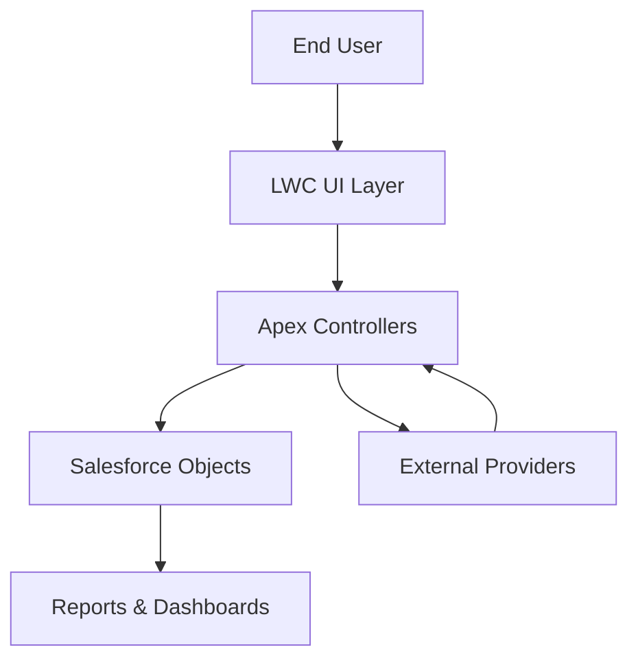
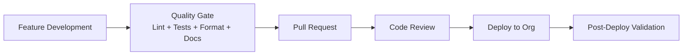
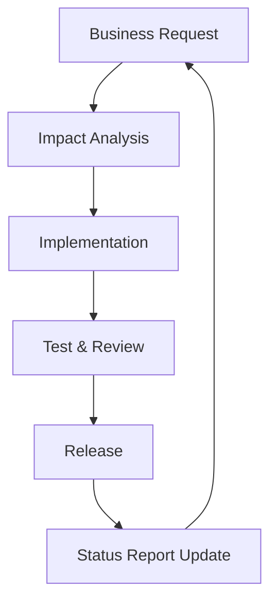

# PWChrono HRMS — System Flow

This document captures end-to-end project flows in Mermaid so diagrams remain version-controlled and reviewable in pull requests.

## 1) High-level platform flow

## 2) Delivery lifecycle flow

## 3) Request-to-status reporting flow

## Notes

- Keep node labels short and business-friendly.
- Prefer one diagram per concern (architecture, delivery, reporting).
- Update this file when adding/removing major LWC modules, Apex controllers, or process stages.
